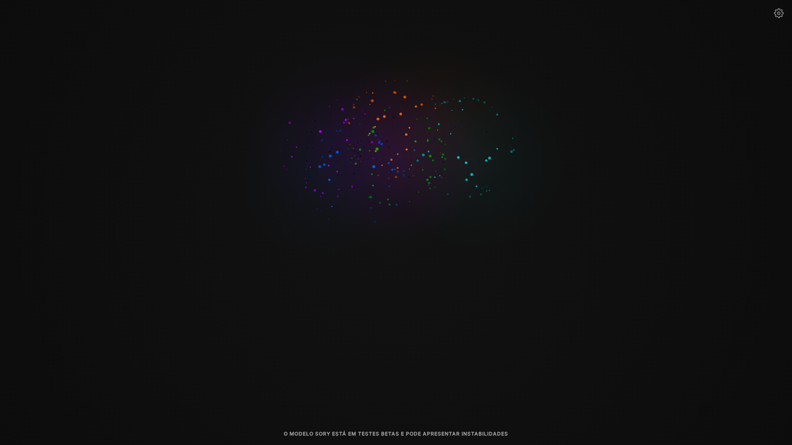
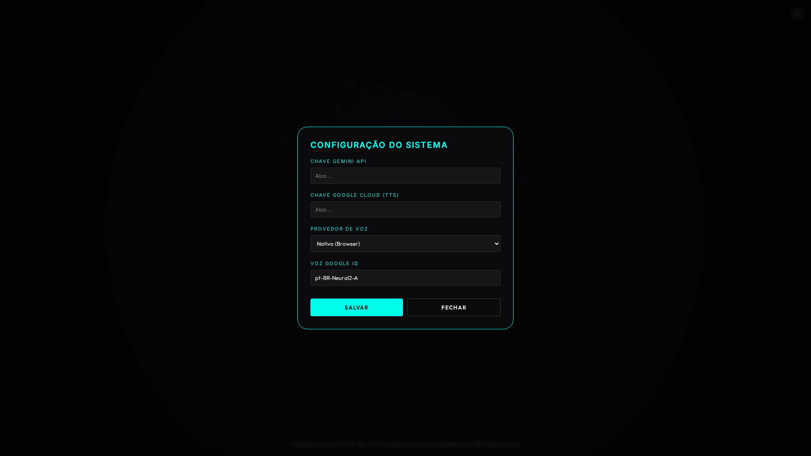

# SORY - Cognitive AI Interface

A highly advanced, modular, client-side AI interface featuring **Google Cloud Neural TTS**, **Cognitive Mesh Visualization**, and **Local-First Memory**.

## Features

### 1. Cognitive Mesh Visualization
Visualizes thoughts and memory fragments as a floating neural network.

### 2. Strategic Planning Mode (`/plan`)
A dedicated interface for breaking down complex goals into nodes and steps.

### 3. Voice & Vox Interface
Real-time transcription and speech synthesis using Google Cloud Neural2 voices.

### 4. Configuration & Security
Securely manage API keys via a local settings modal (Glassmorphism UI).

## Architecture

- **Frontend:** Vanilla JS (ES Modules) + WebGL (Aura)
- **State Management:** `localStorage` + File System Access API
- **Modular Design:**
  - `js/cognitive-*.js`: Logic for thinking, dreaming, and mesh visualization.
  - `js/authority-*.js`: Trust scores and master control directives.
  - `js/api-*.js`: External fetchers (Wiki, Weather, Reddit).
  - `js/commands-*.js`: Extensible command parser.

## Usage

1. **Install Dependencies:** (None required for runtime, just a static server)
2. **Start:** `python3 -m http.server 8080`
3. **Open:** `http://localhost:8080`
4. **Setup:** Click the Settings icon (top right) to add your Google/Gemini keys.

## License
MIT
