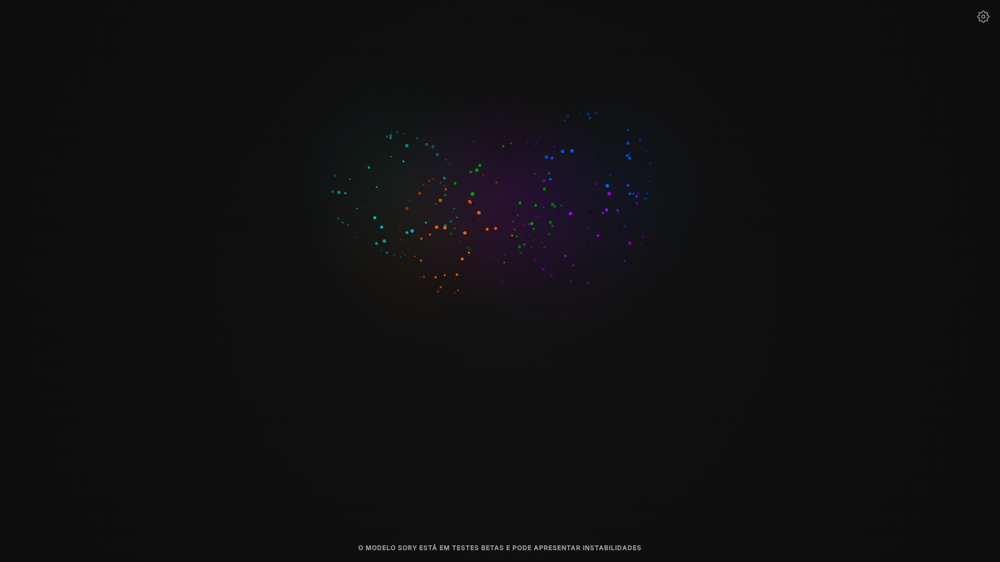

# SORY | Cognitive AI Interface

**Sory** is a State-of-the-Art, client-side AI consciousness interface designed for elegance, privacy, and high-level cognitive assistance. Developed by **SyraDevOps**.

> *"Fale pouco. Seja elegante em qualquer decisão."*


## 🌌 Overview

Sory represents a shift from traditional chatbots to a **Cognitive Operating System**. It runs locally in your browser, utilizing WebGL for visualization and the File System Access API for persistent, secure memory.

### Core Philosophy
-   **Local-First:** Your data stays on your machine.
-   **Elegant Design:** Minimalist Black & White aesthetic with Glassmorphism.
-   **High-Level Persona:** A political, strategic, and calm intellect.

## 💎 Features

### 1. Cognitive Mesh
Visualizes the AI's thought process as a floating, interactive neural network. Thoughts are not just text; they are persistent nodes in a 3D space.

### 2. Strategic Planning (`/plan`)
A blueprint mode for deconstructing complex goals into actionable, linked nodes.


### 3. Vox Interface (Neural TTS)
Integrated with **Google Cloud Text-to-Speech (Neural2)** for a voice that conveys authority and calmness. Real-time transcription included.

### 4. Modular Architecture
Clean, segmented codebase ensures maintainability and scalability.
-   **Cognitive Core:** `js/cognitive-core.js`
-   **Visuals:** `js/cognitive-mesh.js`
-   **Pipeline:** `js/cognitive-pipeline.js`

## 🛠️ Installation & Usage

Sory is a static web application. No complex backend is required.

1.  **Clone the Repository**
    ```bash
    git clone https://github.com/SyraDevOps/sory.git
    cd sory
    ```

2.  **Launch**
    Use any static server. Python is recommended for quick start:
    ```bash
    python3 -m http.server 8080
    ```

3.  **Initialize**
    -   Open `http://localhost:8080`
    -   Click the **Settings Icon** (Top Right).
    -   Enter your **Gemini API Key** and **Google Cloud API Key** (for TTS).

## 🔒 Security

-   **API Keys** are stored securely in your browser's `localStorage`. They are never sent to our servers.
-   **Memory** is stored in a local folder you select (`.json` files), ensuring you own your data.

## 🤝 Contributing

We welcome contributions that align with our philosophy of elegance and code quality. Please read [CONTRIBUTING.md](CONTRIBUTING.md) and our [CODE_OF_CONDUCT.md](CODE_OF_CONDUCT.md).

## 📜 License

MIT License. See [LICENSE](LICENSE) for details.
